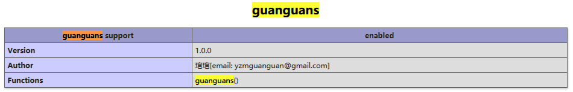

开发一个简单的 PHP 扩展来学习 PHP 扩展开发和 PHP 内核

## 一、安装

1.1 下载

``` bash
git clone https://github.com/guanguans/guanguans-php-ext.git
```
1.2 编译安装

``` bash
/path/to/phpize
./configure --with-php-config=/path/to/php-config
make -j && make install
```

1.3 在 php.ini 中添加

``` bash
extension = guanguans.so
```

1.4 重启 php-fpm

## 二、使用扩展

2.1 查看拓展




2.2 测试拓展


